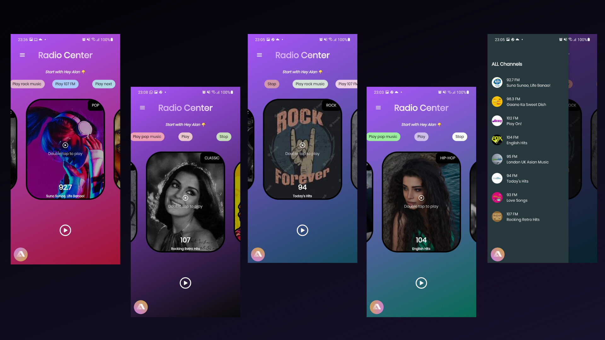
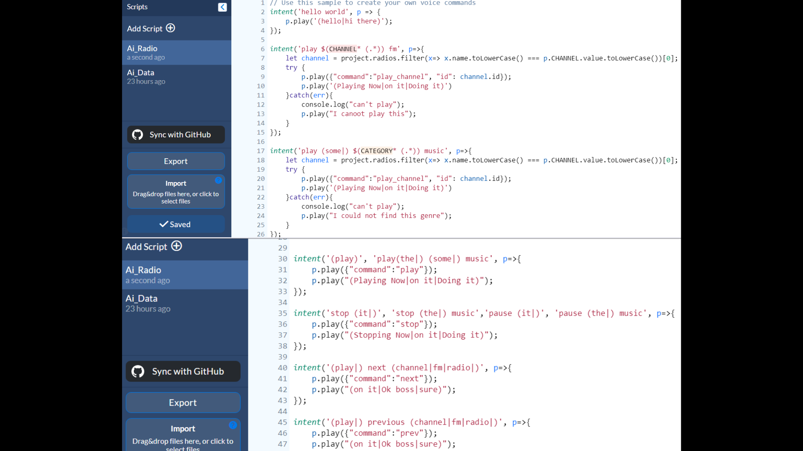

# Radio Center

Projeto completo de um aplicativo de radio integrado a uma AI (Alan).

 
## Como funciona?

O app consiste em uma radio na qual se consome alumas Apis de sua escolha para que toque suas radios preferidas.

Integrado a radio esta a AIAlan pre programada para executar comandos dentro do app atraves de comandos de voz.

Segue abaixo imagens do App e o codigo usado para configurar o script da ai no site da Alan Studio.

Lembrando que o Alan tambem pode ser configurado em pt-br se assim preferir.

Site: https://studio.alan.app/

#PREVIEW
##

##

